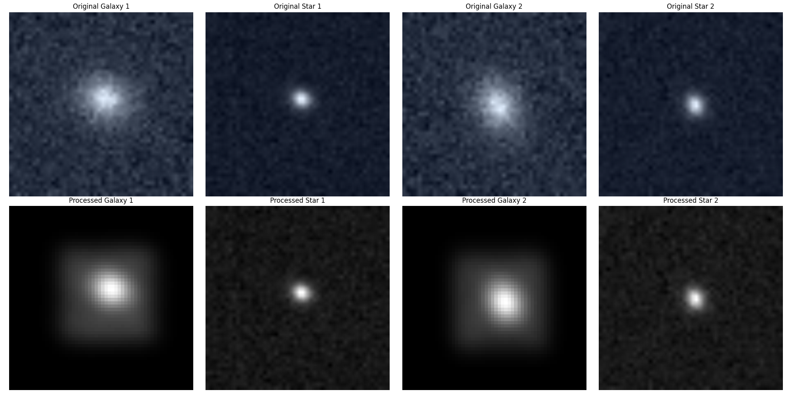

# Dark Matter Mapping Pipeline

## Project Overview
This project develops an advanced image processing pipeline for dark matter mapping using galaxy and star image pairs. The pipeline implements sophisticated preprocessing techniques to handle atmospheric effects, reduce noise, and preserve crucial features in astronomical images.

## Project Status
🚧 **Under Active Development** 🚧

This project is currently in development with ongoing improvements to the preprocessing pipeline. Installation instructions will be added once the pipeline stabilizes.

## Features

### Data Processing Pipeline
- Handles pairs of galaxy and star images (40,000 training, 60,000 test images)
- Processes atmospheric and telescope effects using Point Spread Function (PSF) from star images
- Implements advanced noise reduction while preserving galaxy features
- Manages pixelization effects with feature preservation

### Key Components

#### Data Loading (`data_loader.py`)
- Custom dataset implementation for galaxy-star image pairs
- Efficient batch processing with data augmentation options
- Configurable image preprocessing and normalization

download the image data from [https://www.kaggle.com/competitions/mdm/data](https://www.kaggle.com/competitions/mdm/data)

#### Image Preprocessing (`preprocessor.py`)
- Advanced background subtraction with multi-scale processing
- Adaptive denoising with feature preservation
- PSF extraction and enhancement from star images
- Sophisticated convolution handling for atmospheric effects





#### Validation (`validation.py`)
- Comprehensive pipeline validation tools
- Visual and numerical quality assessment
- Detailed logging and progress tracking
- Performance metrics monitoring

## Pipeline Structure
```
project/
├── src/
│   ├── data/
│   │   ├── data_loader.py      # Data loading and batching
│   │   └── preprocessor.py     # Image preprocessing pipeline
│   └── training/               # Training modules (in development)
├── tests/                      # Test suite
├── validation_output/          # Validation results
└── validation.py              # Validation utilities
```

## Technical Details

### Image Processing Steps
1. Initial denoising with wavelet-based methods
2. Background subtraction using multi-scale analysis
3. PSF extraction and enhancement from star images
4. Feature-preserving pixelization
5. Atmospheric effect simulation using PSF convolution
6. Final contrast enhancement and normalization

### Quality Control
- Automated validation of preprocessing results
- Visual inspection tools for processed images
- Logging system for tracking processing metrics
- Batch processing verification

## Dataset Information
- **Training Set**: 40,000 galaxy-star image pairs
- **Test Set**: 60,000 galaxy-star image pairs
- **Image Format**: PNG files
- **Naming Convention**: 
  - Galaxies: `mdm_galaxy_nnnn.png`
  - Stars: `mdm_star_nnnn.png`
- download the image data from [https://www.kaggle.com/competitions/mdm/data](https://www.kaggle.com/competitions/mdm/data)

## Project Goals
- Develop robust preprocessing for dark matter mapping
- Preserve galaxy morphological features
- Handle atmospheric and telescope effects
- Provide consistent, high-quality image processing
- Support large-scale astronomical surveys

---

**Note**: This project is part of ongoing research in dark matter mapping and astronomical image processing. Features and implementation details are subject to change as the project evolves.

