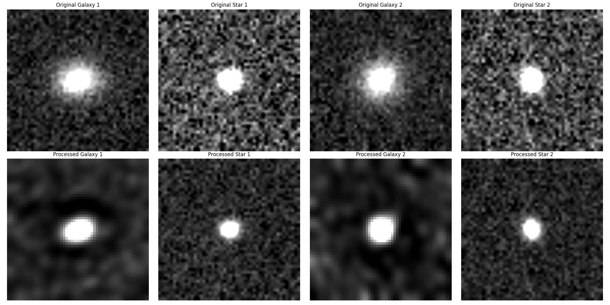

# Dark-matter-mapping-model
Developing an innovative image processing pipeline that analyzes weak gravitational lensing data through deep learning. 

download the image data from [https://www.kaggle.com/competitions/mdm/data](https://www.kaggle.com/competitions/mdm/data)

